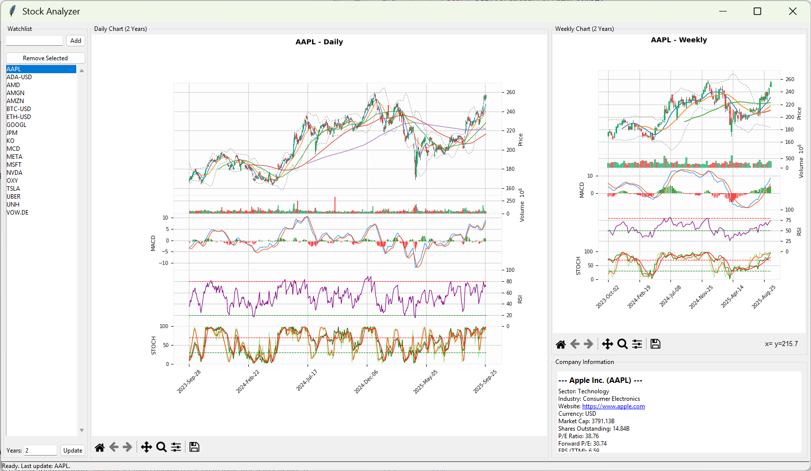

# Stock Analyzer

The `stockAnalyzer.py` script is a Python-based application for analyzing stock data. It provides a graphical user interface (GUI) for fetching, processing, and visualizing stock data, including technical indicators such as Moving Averages, Bollinger Bands, MACD, RSI, and Stochastic Oscillator.


## Features

- **Stock Watchlist Management**: Add, remove, and manage a list of stock tickers.
- **Data Fetching**: Fetch historical stock data from Yahoo Finance using the `yfinance` library.
- **Technical Indicators**:
  - Simple Moving Averages (SMA)
  - Bollinger Bands
  - MACD (Moving Average Convergence Divergence)
  - RSI (Relative Strength Index)
  - Stochastic Oscillator
- **Charting**: Generate candlestick charts with overlays for technical indicators using `mplfinance`.
- **Company Information**: Display detailed company information, including market cap, P/E ratio, dividend yield, and more.
- **Data Caching**: Save and load stock data locally in Parquet format to reduce redundant API calls.
- **Customizable Timeframes**: Analyze data for a user-defined number of years (1–20 years).

## Requirements

- Python 3.10 or higher
- Required Python libraries:
  - `datetime`
  - `pandas`
  - `matplotlib`
  - `mplfinance`
  - `yfinance`
  - `tkinter` (built-in with Python)
  - `threading`
  - `typing`
  - `curl_cffi` (for handling rate limits in `yfinance`)
  - `ibapi`

## Installation

1. Clone the repository.
2. Install the required dependencies using pip:
   ```bash
   pip install pandas numpy matplotlib mplfinance yfinance curl-cffi datetime threading typing ibapi
   ```
3. Run the script:
   ```
   cs src
   python stockAnalyzer.py
   ```

## Usage

1. **Launch the Application**: Run the script to open the GUI.
2. **Add Tickers**: Use the "Add" button to add stock tickers to the watchlist.
3. **Select a Ticker**: Click on a ticker in the watchlist to load its data.
4. **View Charts**: View daily and weekly candlestick charts with technical indicators.
5. **Adjust Timeframe**: Use the "Years" input to change the analysis period (1–20 years).
6. **Company Information**: View detailed company information in the "Company Information" section.

## Example

1. Add a stock ticker (e.g., `AAPL`) to the watchlist.
2. Select the ticker to load its data.
3. View the daily and weekly charts with technical indicators.
4. Adjust the analysis period using the "Years" input.

## Troubleshooting

- **Rate Limits**: The script uses `curl_cffi` to handle the rate limits failure when using Yahoo Finance.

## License
Apache-2.0 license 

## Acknowledgments

- [Yahoo Finance API](https://github.com/ranaroussi/yfinance)
- [mplfinance](https://github.com/matplotlib/mplfinance)
- [InteractiveBrokers Download](https://interactivebrokers.github.io/)

